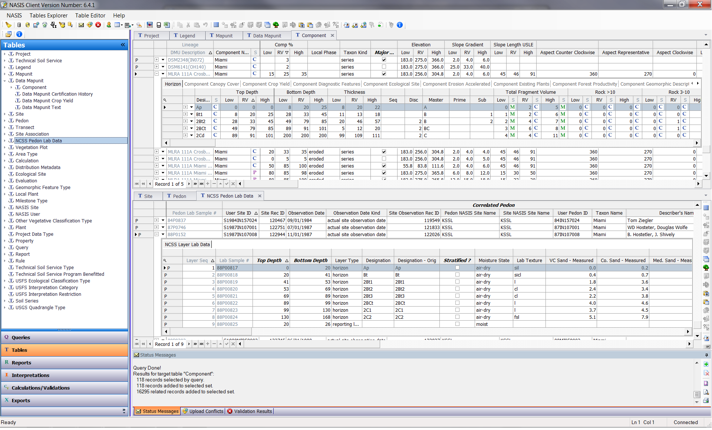

```{r options, echo=FALSE}
knitr::opts_chunk$set(echo=FALSE, results='asis', message = FALSE, warning = FALSE)
```

```{r pkgs}

library(aqp)
library(soilDB)
library(soilReports)
library(RColorBrewer)
library(ggplot2)
library(dplyr)
library(tidyr)
library(knitr)

```

1. USDA-Natural Resource Conservation Service, Indianapolis, IN, USA 46278, stephen.roecker@in.usda.gov
2. USDA-Natural Resource Conservation Service, Missoula, MT, USA 59808
3. USDA-Natural Resource Conservation Service, Sonora, CA, USA 95370
4. USDA-Natural Resource Conservation Service, Lincoln, NE, USA 68508


# Abstract

Soil scientists have been describing and analyzing pedons for over a hundred years. In the USA, a small portion of this data has been captured in the National Soil Information System (NASIS). While NASIS serves as a data repository, its analytical capabilities are limited, and the data are underutilized. In order to facilitate the analysis of soil horizon data in NASIS we have used R to develop R Markdown (Rmd) reports. These Rmd reports are designed to provide numerical and graphical summaries of soil horizon data used for soil survey activities, such as the development of Official Series Descriptions and soil map unit components.

Keywords: soil series, range in characteristics, NASIS, pattern matching


# Introduction

Pedon data consists of field estimates, observations, and laboratory measurements. Unlike the soil map unit polygons and their associated attribute data (component data), pedon data represent point data from individual soil observations. In support of soil surveys during the last 100 years the National Cooperative Soil Survey (NCSS) has collected a substantial amount of pedon data. Since the introduction of the National Soil Information System (NASIS) in 1994 (Fortner and Price, 2012), approximately 400,000 field pedons and approximately 63,000 lab pedons have been digitized (Ferguson, 2015, personal communication). While significant, this represents only a small portion of total field pedons ever described (Fig. 1). For digital soil mapping and updates to soil surveys these pedon data are an invaluable resource. 

```{r n_pedons}

pedons <- data.frame(pedons = c(577, 6152, 9517, 19058, 42587, 112182, 231609, 184913),
                     year   = c("<1950s", "1950s", "1960s", "1970s", "1980s", "1990s", "2000s", "2010s"),
                     stringsAsFactors = FALSE
                     )

ggplot(pedons, aes(x = year, y = pedons)) + 
  geom_bar(stat="identity") + 
  ylab('Number of Pedons') + xlab('Decade') +
  labs(caption = "Fig. 1. Number of pedons sampled per decade recorded in NASIS.")

```

In order to store soil data compactly and efficiently, NASIS has a hierarchical data structure (Fig. 2). One branch of the data structure stores point data - observations of site and pedon data, with soil horizons as the basic element. Aggregated data about soil map units and their soil components are stored in another part of the structure. Each aggregated soil component is made up of generalized soil horizons based on a sample of pedon observations. Also linked to each horizon record are additional child tables. Each of these nested child tables, may include several related child tables in order to capture heterogeneous soil conditions within each soil horizon. The dominant condition is specified as the representative value (RV). For numeric component data, it is also possible to specify a range with Low (L) and High (H) values. This makes it possible to characterize the distribution or variation of a particular soil variable, such as clay content. Using this database structure it is possible to capture soil horizonation, aggregate the data, and then generate spatial predictions by linking it to the soil polygons.


*Fig. 2. Screenshot of the NASIS database interface, and the Component and Lab tables.*

Soil mapping involves aggregating horizon descriptions from field and lab pedons into component horizon data. While there are standards that guide the process of describing individual sites and pedons in the Soil Survey Manual (Soil Survey Division Staff, 1993) and the Field Book for Describing and Sampling Soils (Schoeneberger et al., 2012), there are no guidelines for the process of aggregating point/pedon observations into their component database elements. The NCSS guidelines either address developing Official Series Descriptions (OSD) (USDA, 2015), or how component ranges relate to the OSD (USDA, 2003). Historically, the process of determining the ranges (L, RV, H) for various soil properties has been done with pencil and paper or spreadsheets, and then selected by expert knowledge. This is a practice that continues today for a variety of reasons:

1. Familiarity with existing protocol
2. Inconsistency among the existing data
3. Additional workload involved in digitizing data
4. Perceived or real software limitations
5. Lack of training in new software and statistical methods

Prior to the advent of NASIS there were many early attempts at estimating low, RV, and high values for soil properties (Young et al., 1991; Jansen and Arnold, 1976). These earlier attempts looked at estimates for portions of the soil profile, such as surface texture or subsoil clay content, and utilized parametric estimates (i.e. mean and confidence intervals). They also demonstrated the disconnect between the limits set for taxonomic units and those observed within map unit components. This issue is now addressed by Soil Survey Technical Note 4 (USDA, 2003), which allows the range (i.e. low and high) of map unit components to extend beyond those specified by the OSD.

It is possible to manipulate and summarize pedon data directly in NASIS with reports and pivot tables, but the majority of summary functions within NASIS have been designed to analyze and evaluate component-level aggregate data. Data can be exported from NASIS to other software (Table 1), but these other software do not provide the same concise summary of data as do the reports designed for component data in NASIS. New reports can be added to NASIS, but complex reports are difficult to write because NASIS supports a limited implementation of the Structured Query Language (SQL) which has few functions for performing statistical analysis. Here we advocate exporting pedon data to R (R Core Development Team, 2015). R now supports R Markdown (Rmd) reports that provide access to report-writing capabilities (Xie, 2014; Allaire et al., 2015), and user-contributed functions specifically designed for digital soil morphometrics, such as the aqp (Beaudette et al., 2012), soilDB (Beaudette and Skovlin, 2015), and soiltexture (Moeys, 2015) packages.  

```{r tools}

kable(data.frame(
  `Tabular analysis` = c("1. Pencil and paper", "2. Excel spreadsheets", "3. PedonPC and Analysis PC (Microsoft Access databaes)", "4. NASIS", "5. R"),
  check.names = FALSE
  ),
  caption = "Table 1: Sample of tools for analyzing soil data sorted by user sophistication."
  )

kable(data.frame(
  `Spatial analysis` = c("1. SoilWeb", "2. Web Soil Survey", "3. Soil Data Viewer", "4. SSURGO file geodatabaes", "5. R"),
  check.names = FALSE
  ))

```


# Methods

To generate Markdown documents RStudio was used. RStudio is an Integrated Development Environment (IDE) for R, and provides a minimalist Graphical User Interface (GUI) that organizes the R environment into four task oriented windows. The initial startup process of using RStudio and R to run the reports requires the user to install several R packages and their dependencies and setup an ODBC connection to NASIS. These steps are documented online at the NRCS Soils job-aid page, and readers are pointed to these reference documents for full details. R is an extendable environment, and is in constant development, so installing additional packages is a common practice as packages are updated or new packages become available.

In order to access NASIS data for use in R, a user must first load a selected set of field or lab pedons in NASIS. A selected set is a view or virtual table that is created via a query, and serves as a working subset of a user's local NASIS database. NASIS has numerous queries to accomplish this. Once the data is loaded in NASIS, it can be imported into R via an ODBC connection using the fetchNASIS() function in the soilDB package. The user only needs to modify the report script by entering the name of the text file (e.g. "Miami") containing the GHL rules that correspond to the pedons loaded in the selected set. The report script is then run and an html document is generated by pressing the Knit button in RStudio. The necessary analysis steps are programmed into the report script and the output is formatted to html using Rmd.

To develop a list of GHL, the user must specify which horizons are similar enough to be aggregated (Fig. 3). This is accomplished by mapping the existing horizon designations for each horizon, and matching them to a generalized (i.e. simplified) horizonation sequence for each soil series or component. The assumption is made that the existing horizon designations accurately reflect the soil morphology and the corresponding soil properties of the horizons. For established soil series, the Official Series Description (OSD) can be used as a starting point for determining the appropriate GHL to assign to the horizons for the soil in question. The OSD provides a sample of likely horizons within either the typical pedon described or the range in characteristics (RIC) sections. For example, multiple Bt horizons might be aggregated or grouped together if it is determined that they are similar in clay content and other characteristics and that such an aggregation is not going to affect the use or interpretation of that soil. Also, Bw and Btk horizons might be aggregated if the development of the Btk horizons are incipient and do not meet the definition of an argillic or calcic diagnostic horizon. Another approach is to examine the frequency with which each horizon occurs (Fig. 4). Horizons that occur frequently are likely to be the most representative. 


*Figure 3: Hand drawn illustration of the decision making (e.g. question asking) process soil scientists go through when determining the best selection of GHL for several similar soil descriptions.*


```{r genhz_sort}

data(loafercreek, package = 'soilDB')
pedons <- loafercreek
counts <- sort(table(pedons$hzname), decreasing=TRUE)[1:10]
barplot(counts, ylab = "Number of occurances", xlab = "Horizon designations")

```
*Figure 4: Example of the original horizon designations sorted by frequency of occurrence for the Miami soil series.*

Once appropriate GHL have been determined for the collection of pedons, pattern matching is used to assign the new GHL to each horizon. The process uses functions designed to parse the text from each horizon designation, and match it to the new GHL. The function searches for any combination of characters before or after the specified pattern. Patterns that do not match any of the GHL are labeled "not used". Special meta-characters serve as anchors or anti-wildcards for the beginning (i.e. caret "^"), and end (i.e. dollar sign "$") of the given pattern. For example, the GHL pattern "Bt" will match any permutation of Bt, such as 2Bt or Bt1. To exclude 2Bt horizons, a more specific pattern of "^Bt" would be necessary. Conversely, to exclude Bt1 horizons, a pattern of "Bt$" would be used. If a user wishes to match special character like the caret "^" symbol, which is also used for human transported material, it is necessary to append it with two backslashes like so, "\\^". As the GHL rules are developed they are stored in a text file, and later referenced by the Rmd report. If the user is satisfied with the resulting GHL designations, they can upload it to the comp layer ID field in the horizon table in NASIS where it is stored for future use.

*Example of the GHL rules for the aqp loafercreek sample data-set:*

    - **A**: `^A$|Ad|Ap`
    - **Bt1**: `Bt1$`
    - **Bt2**: `^Bt2$`
    - **Bt3**: `^Bt3|^Bt4|CBt$|BCt$|2Bt|2CB$|^C$`
    - **Cr**: `Cr`
    - **R**: `R`
  
Embedded in the reports are numerical and graphical summarizes of the data elements typically collected and used to differentiate dissimilar soils. Numerical variables are summarized by percentiles (i.e. quantiles), instead of the mean and confidence intervals, because they provide non-parametric estimates of a distribution and are less influenced by skewness which is common for most soil properties. Also percentiles provide a neat and compact summary. The percentiles used can be adjusted by the user, but the default is set to 0%, 25%, 50% or median, 75%, 100% (Tables 3 and 4). Additionally, the percentiles are appended with the number of observations (n) (e.g. (0%, 25%, 50% or median, 75%, 100%)(n)), to inform the user of the sample size. The standard graphics used are box plots which provide a similar summary and interpretation (outliers, ~5%, ~25%, 50% or median, ~75%, ~95%, outliers) of the data (Fig. 6). To summarize categorical variables, frequency tables (i.e. contingency tables) are used which cross-tabulate the number of occurrences of matching pairs. (Tables 5 and 6).  


# Results and Discussion

The full field and lab reports are not shown here due to space limitations. The list below summarizes their content followed by sample excerpts and a discussion of the field and lab reports content.

- Field pedon report content:
    - General map of geo-referenced pedon locations overlaid on county boundary outlines
    - Table of identifying information: pedon id, soil series, etc...
    - Soil profile plots (Fig. 5)
    - Surface rock fragments
    - Depths and thickness of diagnostic horizons
    - Comparison of GHL vs original horizon designations (Table 2)
    - Depth and thickness distribution of GHL
    - Numeric variables: clay content, rock fragments, pH, etc... (Table 3)
    - Soil texture and texture class modifier summarized by GHL (Table 5)
    - Soil color hue summarized by GHL
    - Elevation, slope gradient and slope aspect
    - Parent material vs landform
    - Slope shape (down slope vs across slope shape)
    - Drainage class vs hillslope position

-  Lab pedon report content:
    - General map of georeferenced lab pedon locations overlaid on county boundary outlines
    - Table of identifying information: pedon id, soil series, etc...
    - Soil profile plots (Figure 4)
    - Weighted averages for the particle size control section
    - Depths and horizon thickness for the particle size control section
    - Comparison of GHL vs original horizon designations (Table 2)
    - Depth and horizon thickness of GHL
    - Numeric variables: particle size fractions, pH, base saturation, carbon content, etc... (Table 4)
    - Lab soil texture summarized by GHL (Table 6)
    
Much of the information contained in the reports is used to summarize data for developing OSD and aggregated map unit soil components. Evaluating the graphics and tables within the reports quickly show where there are possible errors, narrow or wide ranges in values or where data gaps exist due to insufficient data. One of the first outputs of the report that should be examined is the contingency table of the GHL versus the original horizon designations (Table 2). This shows the results of the pattern matching and should be examined to confirm whether the GHL assignments aggregate the soil horizons appropriately. For example GHL that are labeled as "not used", did not match any of the given patterns and were not included in the data summaries. The user may in some cases wish to further examine these horizons and decide whether or not to refine the GHL rules to include/exclude them from the summaries.

As an example the following tables and figures show excerpts from all the field and lab data labeled as the Miami soil series within NASIS (Table 3, 4, and 5) (Figs. 4 and 5). The example shows that the field estimates of clay content are missing for A horizons. Given the age of the dataset, which ranges from 1951 to 2014, this is not surprising, as it has not always common to record field estimates for clay content. The lab data for comparison has numerous measurements of clay content. By examining the boxplots we can see a clay increase in the Bt and 2Bt horizons, and a decrease in the 2Cd horizon. The boxplots for pH show a wide interquartile range and a slight decrease in the median pH with depth. The subsoil (i.e. 2BCt and 2Cd) shows a much narrow interquartile range and higher median pH. Examining the contingency tables of GHL vs. texture we can see a greater frequency of silty textures in the A and E horizons. The Bt horizon has a higher frequency of clay loam textures. If silty textures are indicative of the loess cap associated with the Miami series, numerous Bt horizons should be relabeled as 2Bt horizons. The report's summaries allow soil scientists to examine their data quickly; particularly when the data are viewed in aggregate.


```{r miami}

miami_lab   <- fetchNASISLabData()
miami_field <- fetchNASIS()

```

```{r genhz}

n <- c("A", "Ap", "E", "Bt", "2Bt", "2BCt", "2Cd")
p <- c("A", "Ap|AP|A p", "E", "T|t", "2B", "BC|CB|B3", "2C|d")

miami_field$genhz <- generalize.hz(miami_field$hzname, n, p)
miami_lab$genhz   <- generalize.hz(miami_lab$hzname,   n, p)

cross.tab <- table(miami_field$genhz, miami_field$hzname)
top.hz <- order(apply(cross.tab[1:7, ], 2, sum), decreasing = TRUE)[1:20]
kable(cross.tab[, top.hz], digits = 0, caption = "Table 2: Number of the GHL vs the original horizon designations for the Miami series.")

```

```{r profile_plots, fig.width=12, fig.height=6}

# plot sample of miami field pedons

cols <- brewer.pal(n = length(levels(miami_field$genhz)), name = "Set1") 
hz.names <- levels(miami_field$genhz)
# assign a color to each generalized horizon label
miami_field$genhz.soil_color <- cols[match(miami_field$genhz, hz.names)]

# plot generalized horizons via color and add a legend
plot(miami_field[1:10], name = 'hzname', color = 'genhz.soil_color', label = 'pedon_id', cex.names=0.75) 
title("Sample of soil profile plots for field pedons")


# plot sample of miami lab pedons

hz.names <- levels(miami_lab$genhz)
# assign a color to each generalized horizon label
miami_lab$genhz.soil_color <- cols[match(miami_lab$genhz, hz.names)]
# plot generalized horizons via color and add a legend
plot(miami_lab[1:10], name = 'hzname', color = 'genhz.soil_color', label = 'labpeiid', cex.names=0.75) 
legend('bottomleft', legend=hz.names, pt.bg=c(cols), pch=22, horiz = TRUE, pt.cex = 2)
title("Sample of soil profile plots for lab pedons")

```
*Fig. 5: Example soil profile plots of the field (top) and lab (bottom) pedons for the Miami soil series. Horizons are colored according to their GHL.*

```{r boxplots}
# plot boxplots of miami genhz
h  <- horizons(miami_field)
lh <- horizons(miami_lab)

h_lo <- select(h, genhz, clay, phfield) %>% 
  gather(key = variable, value = value, clay, phfield, - genhz)
h_5n <- group_by(h_lo, genhz, variable) %>% 
  summarize(range = prettySummary(value))
h_wi <- spread(h_5n, variable, range)

kable(h_wi, align = "c", caption = "Table 3: Percentile summaries of field estimates of clay (%) and pH.")

lh_lo <- select(lh, genhz, claytot, ph1to1h2o) %>%
  gather(key = variable, value = value, claytot, ph1to1h2o) 
lh_5n  <- group_by(lh_lo, genhz, variable) %>%
  summarize(range = prettySummary(value))
lh_wi <- spread(lh_5n, variable, range)

kable(lh_wi, align = "c", caption = "Table 4: Percentile summaries of laboratory measurements of clay (%) and pH.")

# change variable names via factor levels
h_lo$variable <- factor(h_lo$variable, levels=c('clay', 'phfield'), labels=c('Field Estimated Clay (%)', 'Field Estimated pH'))
lh_lo$variable <- factor(lh_lo$variable, levels=c('claytot', 'ph1to1h2o'), labels=c('Lab Measured Clay (%)', 'Lab Measured pH (1:1 H2O)'))

ggplot(h_lo, aes(x = genhz, y = value)) + 
  geom_boxplot() +
  facet_wrap(~ variable, scales = "free_y") +
  xlab("Generalized Horizon Label") +
  ggtitle("Boxplot of Miami field pedons by generalized horizon label")

ggplot(lh_lo, aes(x = genhz, y = value)) + 
  geom_boxplot() +
  facet_wrap(~ variable, scales = "free_y") +
  xlab("Generalized Horizon Label") +
  ggtitle("Boxplot of Miami lab pedons by generalized horizon label")

```
*Figure 6: Box plots of field (top) and lab (bottom) measurements for clay (%) and pH*

```{r texture}

# tables of genhz vs texture
kable(addmargins(table(h$genhz, h$texture_class)), digits = 0, caption = "Table 5: Number of GHL vs. field textures. The values represent the frequency of occurrence (counts) for combinations of GHL and texture.")

kable(addmargins(table(lh$genhz, lh$texcl)), digits = 0, caption = "Table 6: Number of GHL vs. lab textures. The values represent the frequency of occurrence (counts) for combinations of GHL and texture.")

```


# Conclusion

Here we have presented an effort to efficiently analyze the large volume of soil horizon data present in the NASIS database. We have developed R Markdown reports that provide univariate summarizes of the data elements typically used to develop OSD and soil map unit components. Using the relational structure of the NASIS database combined with the extensible data handling and statistical analysis capabilities of R, it is possible to generate powerful graphical and tabular summaries for collections of pedon data bundled into one report. Summarizing pedon data by horizon is a critical and time consuming step in the soil survey workflow. Because we can typically only investigate soil variability by examining several soil profiles and comparing multiple descriptions, viewing the data in aggregate allows us to approximate the representative values and ranges for soil horizons (i.e polypedons), which are the building blocks of soil map unit components.


# Acknowledgements

The methodology presented here has benefited from the input from numerous individuals. Those that stand out include Alena Stephens and John Hammerly who assisted in testing different iterations of the reports, and Henry Ferguson, Paul Finnell, Carrie-Ann Houdeshell and Samuel Indorante who provided valuable feedback.


# References

Allaire. J.J., Cheng, J., Xie, Y., McPherson, J., Chang, W., Allen, J., Wickham, H., and Hyndman, R. (2015). rmarkdown: Dynamic Documents for R. R package version 0.6.1. http://CRAN.R-project.org/package=rmarkdown
  
Beaudette, D.E., Roudier P., and A.T. O'Geen. Algorithms for
  Quantitative Pedology: A Toolkit for Soil Scientists. 2012

Beaudette, D.E., and Skovlin, J.M. (2015)a. soilDB: Soil Database
  Interface. R package version 1.5-2.
  HTTP://CRAN.R-project.org/package=soilDB
  
Fortner, J.R., and Price, A.B., (2012). United States Soil Survey Databases. In: P.M. Huang, Y. Li, and M.E. Sumner, eds. pp. 1-12. Handbook of Soil Sciences: Resource Management and Environmental Impacts 2nd edition, CRC Press. 

Jansen, I.J., and Arnold, R.W (1976). Defining Ranges of Soil Characteristics. Soil Science Society of America Journal 40, 89-92.

Moeys, J. (2015). soiltexture: Functions for Soil Texture Plot,
  Classification and Transformation. R package version 1.3.3.
  HTTP://CRAN.R-project.org/package=soiltexture

R Development Core Team, 2015.R:A Language and Environment for Statistical Computing. R Foundation for Statistical Computing. Vienna, Austria. ISBN3-900051-07-0.

Schoeneberger, P.J., Wysocki, D.A., Benham, E.C., and Soil Survey Staff (2012). Field book for describing and sampling soils, Version 3.0. Natural Resources Conservation Service, National Soil Survey Center, Lincoln, NE.

Soil Survey Division Staff (1993). Soil survey manual. Soil Conservation Service. U.S. Department of Agriculture Handbook 18.

U.S. Department of Agriculture (USDA), Natural Resources Conservation Service. National soil survey handbook, title 430-VI. Available online. Accessed [06/24/2015].

U.S. Department of Agriculture (USDA), Natural Resources Conservation Service. National Instructions, title 430-305, Soil Data Join Recorrelation Initative, 3rd edition. http://directives.sc.egov.usda.gov/viewerFS.aspx?hid=36725 [10/2014].

U.S. Department of Agriculture (USDA), Natural Resources Conservation Service. Technical Note 4, Populating Map Unit Data: Taxonomic classes and map unit componnents. http://directives.sc.egov.usda.gov/viewerFS.aspx?hid=36725 [02/2013].

Yihui Xie (2014) knitr: A Comprehensive Tool for Reproducible
  Research in R. In Victoria Stodden, Friedrich Leisch and Roger D. Peng, editors, Implementing Reproducible Computational Research. Chapman and Hall/CRC. ISBN 978-1466561595

Young, F.J., Maatta, J.M., and Hammer, R.D., (1991). Confidence Intervals for Soil Properties within Map Units.
  In: Spatial Variabilities of Soils and Landforms. M.J. Mausbach and L.P. Wilding, eds. pp. 213-229. SSSA Special Publication Number 28, Soil Science Society of America.
